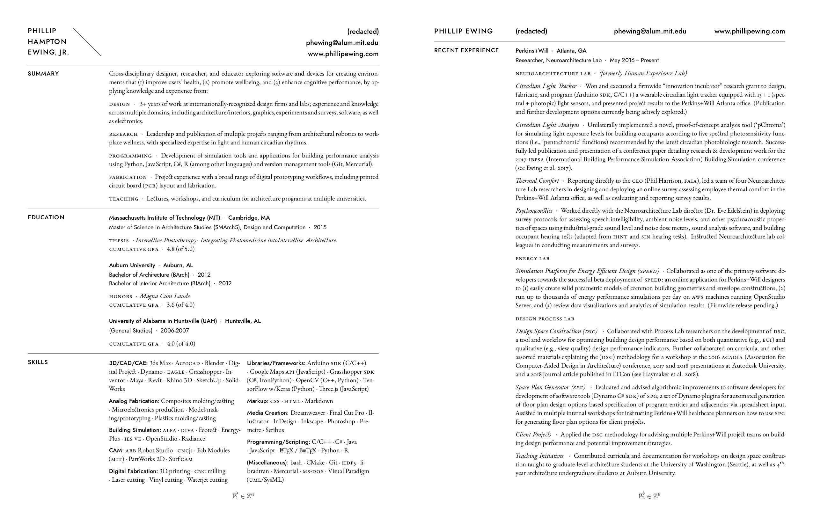

# phewing-CV

## Description

Source code for the CV of Phillip Hampton Ewing Jr., written in LaTeX.

Key files:

+ __`phewing-CV.tex`:__ The main document source file.

+ __`phewing-CV.pdf`:__ The compiled LaTeX output.

+ __`phewing-CV.sty`:__ Contains all of the the required package imports, font
  imports, page geometries, symbol and text style definitions, etc.

+ __`phewing-CV.md`:__ Just a plain-text version of the document to make initial
  writing/ediing easier before implementing in `phewing-CV.tex`.

+ __`phone-number.txt`:__ The main document (`phewing-CV.tex`) reads the phone
  number from this file, adding a level of misdirection for security purposes.
  You can place your phone number here, or edit the `\PhoneNumber{...}` to
  provide it directly.

+ __`modulor.py`:__ A quick little script to generate a scale system for the
  major proportions of the document page and text. It is based on 20th-century
  architect Le Corbusier's well-known _Modulor_ scale, but uses two Fibbonaci
  sequences to generate whole numbers for the scale instead of applying the
  golden ratio (1.618...) directly as in the original sysytem.

## Prerequisites

### LaTeX

Of course, you will need to have one of the several freely-available
distributions of LaTeX in order to compile the source code. A few common
options are listed below:

+ __Windows:__ [MiKTeX](https://miktex.org/),
  [proTeXt](http://www.tug.org/protext/), [TeX
  Live](https://www.tug.org/texlive/)
+ __MacOS:__ [MacTeX](http://www.tug.org/mactex/)
+ __Linux:__ [TeX Live](https://www.tug.org/texlive/)
+ __(Online):__ [Overleaf](https://www.overleaf.com/),
  [Papeeria](https://papeeria.com/), [Datazar](https://www.datazar.com/),
  [LaTeX Base](https://latexbase.com/)

Whichever distribution of LaTeX you choose, make sure that either the
__XeLaTeX__ or __LuaLaTeX__ engines are included, since there are some
non-standard typefaces that must be loaded into LaTeX using the
[`fontspec`](https://ctan.org/pkg/fontspec) package.

Also please note that when using online distributions, you will have to
manually upload .otf files for the typefaces (see "Typefaces" section), and
modify `phewing-CV.sty` to point at those files in your project directory.

### Typefaces

This document requires the [Jost*](https://indestructibletype.com/Jost.html)
typeface by Owen Earl for headings, and the [EB
Garamond](http://www.georgduffner.at/ebgaramond/) typeface by Georg Duffner for
body text. Please make sure that the latest version of all OTF files for these
typefaces are installed on your system prior to attempting to compile, or else
__there *will* be errors.__

Both typefaces are open-source and free to download here on
GitHub ([Jost*](https://github.com/indestructible-type/Jost), [EB
Garamond](https://github.com/georgd/EB-Garamond)), and their full range of
features may readily be accessed by either compiling their source files using
[FontForge](https://fontforge.github.io/) (an open-source font editor)
according to the instructions provided, or as downloading fully pre-compiled
versions with pay-what-you-want donations to the developers.
